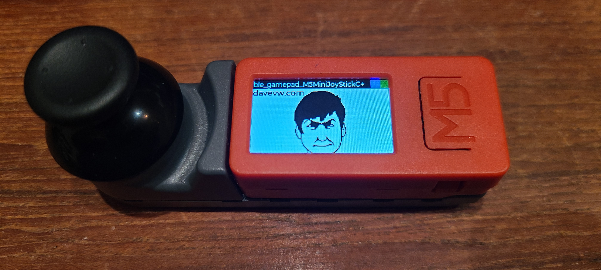

Use this [M5Stack MiniJoyC](https://shop.m5stack.com/products/m5stickc-mini-joyc-hat-stm32f030?variant=43687638302977) on M5Stick-C+ (or M5Stick-C) as a controller to play simple games on your phone, console, computer, etc.

It pairs via Bluetooth (BLE)

M5 is first button, joystick click is second button, hold stick's B (backside in perspective of image) and release to darken screen a bit

Also see:

* [github.com/davervw/Cardputer-Game-Station-Emulators](https://github.com/davervw/Cardputer-Game-Station-Emulators)
* [github.com/davervw/gamepad_test](https://github.com/davervw/gamepad_test)
* [github.com/davervw/ble_gamepad_KanoPixelKit](https://github.com/davervw/ble_gamepad_KanoPixelKit)
* [blog.davevw.com](https://techwithdave.davevw.com/2026/05/ble-hid-gamepad-firmware-for-m5stack.html)
